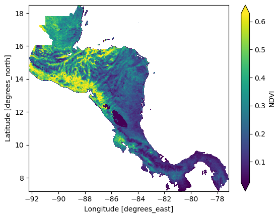

# restee

Python package to call process EE objects via the REST API to local data

[](https://badge.fury.io/py/restee)
[](https://github.com/KMarkert/restee/actions/workflows/docs.yml)
[](https://opensource.org/licenses/MIT)


`restee` is a package that aims to make plugging Earth Engine (EE) computations into downstream Python processing easier. The EE REST API allows user to interface with EE using REST API calls that allow for . There are many more features to the EE REST API, however, `restee` aims to simply provide a user-friendly means to access computed server-side objects (like image data) from the [Python `earthengine-api`](https://developers.google.com/earth-engine/guides/python_install) API to a local Python enviroment (client-side).

It should be noted that `restee` relies on fairly new and advanced EE features that may not be suitable for all users (see [warning from the EE team](https://developers.google.com/earth-engine/reference#audience)). If you are new to Earth Engine, please get started with the [JavaScript guide](https://developers.google.com/earth-engine/getstarted).

## Installation

`restee` relies heavily on the geospatial Python ecosystem to manage different geospatial data formats and execute geospatial processes. It is recommended to use [`conda`](https://docs.anaconda.com/anaconda/install/) to handle the package dependencies and create a virtual environment. To do this run the following command:

```sh
conda create -n restee -c conda-forge -y \
    python>=3.6 \
    numpy \
    scipy \
    pandas \
    xarray \
    rasterio \
    geopandas \
    pyproj \
    requests \
    backoff \
    earthengine-api \
    tqdm
```

Once all of the dependencies are installed, the `restee` package can be installed using `pip`:

```sh
pip install restee
```

It is strongly recommended to read the [Installation documentation]()

## Getting Started

This section is meant purely as a demonstration of what is possible, please see the [Installation page](/installation) for how to install package and setup the authentication then the [Usage page](/usage) for in depth information.

```python
import ee
ee.Initialize()

import restee as ree

# get an authenticated session with GCP for REST API calls
session = ree.EESession("<CLOUD-PROJECT>","<PATH-TO-SECRET-KEY>")

# use ee to get a featurecollection for USA
countries = ee.FeatureCollection("USDOS/LSIB_SIMPLE/2017")
camerica= countries.filter(ee.Filter.eq("wld_rgn", "Central America"))

# define the domain imagery will be requested for
# in this case it is the computed USA featurecollection
domain = ree.Domain.from_ee_geometry(session,camerica,resolution=0.01)

# define some computations
# here we calculate median NDVI for the summer months over the USA
modis = (
    ee.ImageCollection("MODIS/006/MOD09GA")
    .filterDate("2020-06-01","2020-09-01")
    .map(lambda x: x.normalizedDifference(["sur_refl_b02","sur_refl_b01"]))
    .median()
    .rename("NDVI")
)

# request the ee.Image pixels as a xarray dataset
ndvi_ds = ree.img_to_xarray(session,domain,modis,no_data_value=0)

# inspect the local xarray Dataset object
ndvi_ds

# output
# <xarray.Dataset>
# Dimensions:  (lat: 1130, lon: 1509)
# Coordinates:
#   * lon      (lon) float64 -92.23 -92.22 -92.21 -92.2 ... -77.17 -77.16 -77.15
#   * lat      (lat) float64 18.48 18.47 18.46 18.45 ... 7.225 7.215 7.205 7.195
# Data variables:
#     NDVI     (lat, lon) float32 nan nan nan nan nan nan ... nan nan nan nan nan
```

From this point on the computed data is local to your system so you can do with it what you want. This allows the data to be plotted, persisted, or fed into another downstream process. For the sake of example, here we will plot the result.

```python
ndvi_ds.NDVI.plot(robust=True,cmap="viridis")
```



Again, this quick example was to highlight how a user may define an EE computation using the `earthengine-api` and request the data into a local data structure. One may use `restee` to get zonal statitics calculated for feature collections or even explore collection metadata, any format on EE can be requested locally. For more details, please see the [Usage page](/usage).

## Get in touch

Please report any bugs, ask questions, or suggest new features on [GitHub](https://github.com/KMarkert/restee/issues).

## Contribute

Contributions are welcome, and they are greatly appreciated! Every little bit helps, and credit will always be given.

## License

`restee` is available under the open source [MIT License](https://github.com/KMarkert/restee/blob/main/LICENSE).
