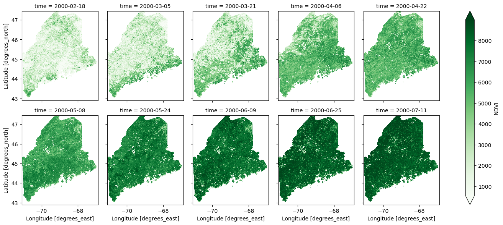
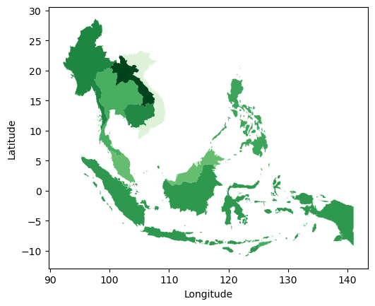

# Using restee

The page serves as more in depth examples of using `restee` to get data from Earth Engine results. Before walking through these examples, please make sure you have gone throught the [Installation page](/installation) and installed everything correctly.

To begin, we will need to import the `ee` and `restee` packages. Next, we need to authenticate Earth Engine and create a authenticated cloud session so we can request the data from the server to our local system.

```python
import ee
ee.Initialize()

import restee as ree

# get and authenticated cloud session for requesting data
session = ree.EESession("<CLOUD-PROJECT>","<PATH-TO-SECRET-KEY>")
```

Now we are ready to crunch some data!

## Requesting Images

Earth Engines core capabilities come from massive geospatial raster processing. It makes working with and processing imagery much easier but often times, one would like to use the results with some other process. `restee` allows for users to request processed imagery to local data structures such as

```python
states = ee.FeatureCollection('TIGER/2018/States')
maine = states.filter(ee.Filter.eq('NAME', 'Maine'))

# get a domain for the state of Maine at ~500m resolution
domain = ree.Domain.from_ee_geometry(session, maine, resolution=0.005)

imshow(domain.mask)
```


Now that we have a domain we can use that to control where on the globe we request imagery. Here we simply grab the first image in the MOD13Q1 NDVI collection and request the data for Maine.

```python
# get an ee.Image object
img = (
    ee.ImageCollection('MODIS/006/MOD13Q1')
    .select("NDVI")
    .first()
)

# request the image as an np.ndarray using the domain
ndvi_arr = ree.img_to_ndarray(session,domain,img)

# inspect the data structure of ndvi_arr
ndvi_arr

# array([[( 3905,), ( 3880,), ( 2823,), ..., ( 2522,), ( 1714,), ( 1714,)],
#        [( 3605,), ( 3447,), ( 3447,), ..., ( 3845,), ( 2324,), ( 2324,)],
#        [( 3399,), ( 3315,), ( 3315,), ..., ( 4584,), ( 2238,), ( 2238,)],
#        ...,
#        [( 5711,), ( 5611,), ( 4905,), ..., (-3000,), (-3000,), (-3000,)],
#        [( 4845,), ( 4791,), ( 4606,), ..., (-3000,), (-3000,), (-3000,)],
#        [( 5101,), ( 4443,), ( 4610,), ..., (-3000,), (-3000,), (-3000,)]],
#       dtype=[('NDVI', '<i2')])
```

The resulting numpy array is the raw data from EE for the region and projected in the coordiates defined by `domain`. The `restee.img_to_ndarray` only returns a structured array of pixel values. To request data while retaining the geographic information, please see the [`restee.img_to_xarray`](/images/#restee.images.img_to_xarray) function.

We can not only request individual images but also an ImageCollection over a region. To do this, the ImageCollection needs to have a `system:time_start` property (this is important when doing some computations as EE drops metadata properties). We will use the Maine example again, however, this time request the first ten images in the collection as a xarray.Dataset which allows us to manage the time dimension

```
# grab the first 10 NDVI images from a MODIS collection
ic = (
    ee.ImageCollection('MODIS/006/MOD13Q1')
    .limit(10,"system:time_start")
    .select("NDVI")
)

ds_ndvi = ree.imgcollection_to_xarray(session,domain,ic,no_data_value=0,verbose=True)

# plot the results
ds_ndvi.where(ds_ndvi.NDVI>=0).NDVI.plot(col='time',col_wrap=5,robust=True,cmap='Greens')
```



This function is handy as it allows for geographic as well as time information to be retained.

It is planned to allow users to define an ImageCollection by other properties than `system:time_start`, however, since ImageCollections are most often time based this functionality should serve most purposes.

## Requesting Tables

Imagery is not the only thing that Earth Engine can process. There are many vector based workflows that are useful on Earth Engine such as sampling values from an image or calculating zonal statistics. To access computed a computed feature or feature collection, `restee` has methods to request the data in a local table structure.

```python
countries = ee.FeatureCollection("USDOS/LSIB_SIMPLE/2017")
seasia = countries.filter(ee.Filter.eq("wld_rgn", "SE Asia"))

computation = img.reduceRegions(
    collection=seasia,
    reducer=ee.Reducer.mean().setOutputs(["NDVI"]),
    scale=1000
)

gdf = ree.features_to_geodf(session,computation)

gdf.plot(column="NDVI",cmap="Greens")
```



Not all computed ee.Feature or ee.FeatureCollections have geometry information, to support the lack of geometry data, `restee` also has a function [`restee.features_to_df`](/tables/#restee.features_to_df) to request the data as a `pandas.DataFrame`.

## Requesting Values

Not all information from Earth Engine is a spatial computation. Sometimes calculating statistics or reading metadata from the image/collections is needed. We can request essentially any ee.ComputedObject to a local Python data type and continue using on our local system.

Here is a quick example of getting a list of dates from an image collection:

```
ic = (
    ee.ImageCollection('MODIS/006/MOD13Q1')
    .limit(10,"system:time_start")
    .select("NDVI")
)

# compute the string format of the image dates
ee_dates = (
    ic.aggregate_array("system:time_start")
    .map(lambda x: ee.Date(x).format("YYYY-MM-dd HH:mm:ss"))
)

# get this list of date strings
dates = ree.get_value(session, ee_dates)

dates
# output 
# ['2000-02-18 00:00:00',
#  '2000-03-05 00:00:00',
#  '2000-03-21 00:00:00',
#  '2000-04-06 00:00:00',
#  '2000-04-22 00:00:00',
#  '2000-05-08 00:00:00',
#  '2000-05-24 00:00:00',
#  '2000-06-09 00:00:00',
#  '2000-06-25 00:00:00',
#  '2000-07-11 00:00:00']
```

The `restee.get_value` function takes essentially any ee.ComputedObject (such as ee.List, ee.Array, ee.Dictionary, ee.String)and will convert it to the Python equivalent for use locally.

## Caveauts

There is a limit to how much data/computations you can request. Typically this manifests itself in 500 error. Please note that this is an Earth Image limit and has little to do with `restee`.

Please refer to the [Quotas and Limits section](https://developers.google.com/earth-engine/reference#quota-and-limits) of the REST API documentation to learn more.
